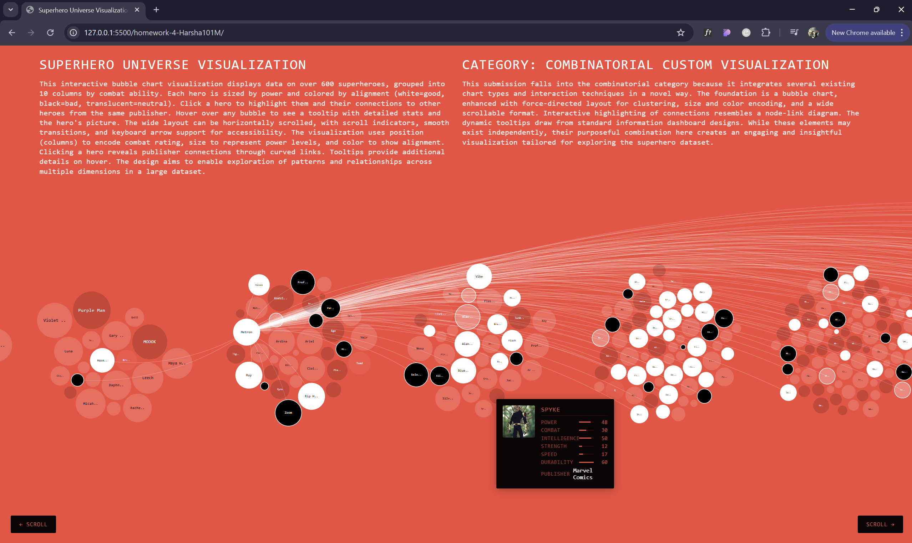

# Interactive Superhero Universe — Custom D3.js Visualization

An interactive "museum exhibit" data visualization that maps 600+ superheroes into a single scrollable view, built with [D3.js](https://d3js.org/). Each hero is encoded by power, combat ability, alignment, and publisher, with click and hover interactions for exploring the dataset.

**[▶ Live demo](https://harsha101m.github.io/Interactive-Superhero-Universe---Custom-D3.js-Visualization/)** · *(replace with your GitHub Pages URL)*



## Overview

The goal was to design a *custom* visualization — not a standard chart type — that communicates a rich dataset to a general audience in an engaging way. The result is a combinatorial design: a bubble field layout enhanced with clustering, multi-channel encoding, and node-link-style connection highlighting.

## Features

- **Multi-attribute encoding in one view** — bubble size maps to a hero's power, color to alignment (good / bad / neutral), and column position to combat rating.
- **Circle-packing & force layout** — heroes are grouped and arranged using `d3.pack` and `d3.hierarchy`.
- **Click to reveal connections** — selecting a hero highlights other heroes from the same publisher, like a lightweight node-link diagram.
- **Rich tooltips** — hovering any hero shows detailed stats (intelligence, strength, speed, durability) and their portrait.
- **Animated transitions** — smooth easing on selection and layout changes.
- **Accessible & navigable** — keyboard arrow support and scroll indicators for the wide, horizontally scrollable canvas.

## Tech stack

- **D3.js v7** — data binding, layout, scales, transitions
- **JavaScript (ES6)** — interaction logic
- **HTML5 / CSS3** — structure and styling
- No build step or framework — open `index.html` and it runs.

## Run locally

Because the page loads a CSV, it needs to be served over HTTP (opening the file directly will hit browser CORS restrictions).

```bash
# From the project folder, start any static server, e.g.:
python3 -m http.server 8000
# then open http://localhost:8000 in your browser
```

## Data

Superhero Power Analytics dataset (~675 heroes and villains), sourced from [Kaggle](https://www.kaggle.com/datasets/shreyasur965/super-heroes-dataset). Attributes used include power, combat, intelligence, strength, speed, durability, alignment, and publisher.

## Notes

This project began as a university data-visualization assignment and has been cleaned up and published as a standalone portfolio piece. The visualization design, encoding choices, and interaction logic are my own.
